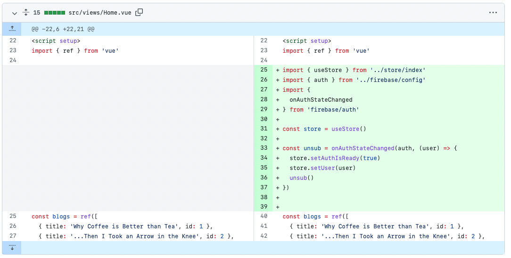

# Vue Blog

This project is based on [The Net Ninja (Shaun Pelling)](https://www.youtube.com/playlist?list=PL4cUxeGkcC9jveNu1TI0P62Dn9Me1j9tG) short tutorial on [Vuex](https://next.vuex.vuejs.org) with [Firebase](https://firebase.google.com) authentication.

## Project Overview

This project simulates a blog website with sign up, sign in, and sign out.

### Home Page

<figure>

    <figcaption>Home page without authenticated user. _Login_ and _Signup_ links are visible.</figcaption>
</figure>

The home page lists recent posts with title, content, and positive or negative voting. However, this is just made up content. The project feature is the sign up, sign in and sign out with Firebase.

<figure>

    <figcaption>Home page with authenticated user. The email replaces the login button. The _logout_ button is now visible.</figcaption>
</figure>

The _home_ page is represented by the `Home` _view_. This view is independent and its only responsibility is to simulate the blog behaviour.

The menu on the top right-hand side enables accessing the features.

### SignUp Page

<figure>

    <figcaption>Simple form that captures new user data. The form sends data to a Vuex `action`.</figcaption>
</figure>

The `SignUp` _view_ implements this page. It consists of a basic form that captures email and password for a new user. This page dispatches the new user data to a Vuex `action` when the _Login_ button is clicked. The sign-up process features a simple exception handling.

### Sign in Page

<figure>

    <figcaption>Form similar to _SignUp_ page, but it signs an existing user in.</figcaption>
</figure>

As the _SignUp_ page, this page consists of a simple form that sends data to a Vuex `action` responsible for signing an existing user in. The `SignIn` page implements the code for this page.

## Components Overview
Apart from the three main _views_ that dispatch `actions` to Vuex store, there are two main components, as follows:

- `Navbar` represents the top navigation bar. This component uses Vuex store to identify the currently logged user. In addition, it dispatches an `action` for sign out the user.

- `store/index.js` implements the Vuex store. It has three main sections: (i) `state`, which stores the user object; (ii) `mutations`, which sets the method that updates a `user`; and (iii) `actions`, which sets `async` methods that calls Firebased sign in, sign up and sign out methods.

## Dependencies

The project has three main dependencies as follows:

- `vue-router` is used to control the page flow;
- `vuex` enables the login state management;
- `firebase` enables managing Firebase auth.

## Running the Project Locally

To run the project, ensure that you have NPM installed.

1. Clone the project locally

```
git clone https://github.com/gabrielcostasilva/vue-blog.git
```

2. Open another terminal. In the project folder, start the project.

```
npm run serve
```

3. Access the app with your browser at `http://localhost:8080`
