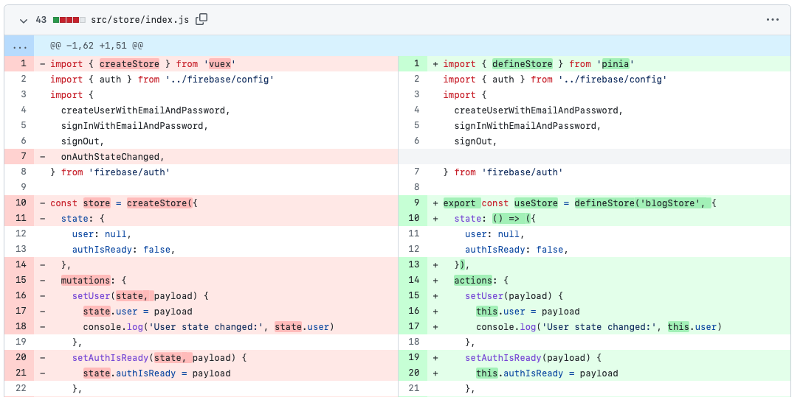

# Vue Blog _With Pinia_

We introduce [Pinia](https://pinia.vuejs.org) in this project as [Vuex](https://vuex.vuejs.org) is no longer the official option for state management.

## Overview of Changes

First, [add Pinia package as a dependency](https://pinia.vuejs.org/getting-started.html#installation) by running `npm install pinia`. 

Second, create Pinia object and set Vue to use it in the `main.js` file.

Third, define the store. We use the same file used by Vuex in this project: `/src/store/index.js`. Note that `state` is a function in Pinia. Pinia has `actions` instead of `mutations`. Functions in `actions` can access the `state` values using `this`. 

Also notice that Pinia does not make difference between sync and async functions, like Vuex used to do. Therefore, `async signup(email, password)` is defined inside `actions`, like previous functions. 

Another difference is that `actions` functions do not need a `context` as parameter. That is because `actions` and `state` can be directed accessed via `this`.

Note that the function `unsub` was moved to `Home.vue`.

Finally, import and use the store. Note that functions are directly accessed now - no need for `dispatch`.

